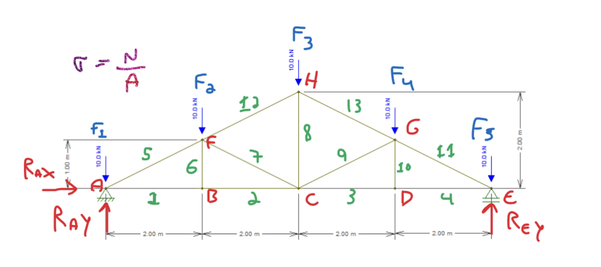
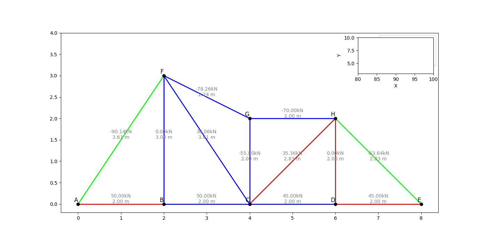
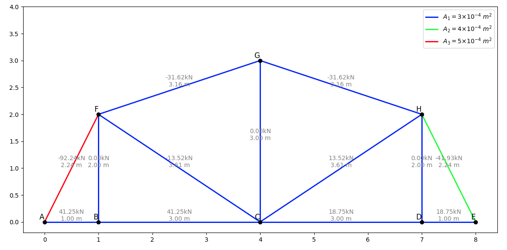

# Treliça Ideal - Otimização de Estruturas de Ponte Howe

Este projeto busca encontrar um arranjo ideal de barras para uma estrutura de ponte do tipo treliça Howe, minimizando simultaneamente o peso total da estrutura e a deformação sob carga.

O problema abordado é de natureza bi-objetiva, envolvendo a otimização de dois critérios: peso e deformação. Para tratar ambos os objetivos de forma conjunta, foi construída uma função objetivo composta, que combina as duas variáveis em uma única métrica de avaliação, evitando a necessidade de construir fronteiras de Pareto.

O algoritmo genético utilizado explora diferentes combinações de dimensões e configurações das barras, em busca da melhor solução segundo esta função agregada. A seguir a treliça base usada para o problema:

## Evolução

A seguir um gif apresentando a evolução das soluções para uma população de 400 indivíduos durante 100 gerações:

## Solução

| Barra | Normal (kN) | Virtual (kN) | L (m) | Delta (mm) |
|:-----:|:-----------:|:------------:|:-----:|:----------:|
| 1     | 41.250      | 0.250        | 1.000 | 0.172      |
| 2     | 41.250      | 0.250        | 3.000 | 0.516      |
| 3     | 18.750      | 0.250        | 3.000 | 0.234      |
| 4     | 18.750      | 0.250        | 1.000 | 0.078      |
| 5     | -92.238     | -0.559       | 2.236 | 1.153      |
| 6     | 0.000       | 0.000        | 2.000 | 0.000      |
| 7     | -13.521     | 0.501        | 3.606 | -0.407     |
| 8     | 0.000       | 0.444        | 3.000 | 0.000      |
| 9     | 13.521      | 0.501        | 3.606 | 0.407      |
| 10    | 0.000       | 0.000        | 2.000 | 0.000      |
| 11    | -41.926     | -0.559       | 2.236 | 0.655      |
| 12    | -31.623     | -0.703       | 3.162 | 1.171      |
| 13    | -31.623     | -0.703       | 3.162 | 1.171      |

- Função objetivo: 0.0742
- Delta total: 5.150 mm
- Peso total: 83.21 kg

